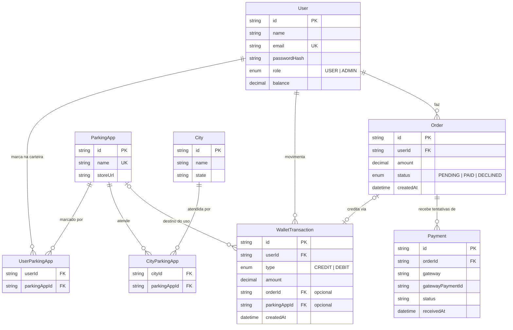

# 🛠️ Architecture / Software Design Document

**Projeto:** Portal EstaR
**Versão:** 1.0.0
**Última atualização:** 2026-08-27

> 🤖 **O `prd.md` responde _o quê_ o produto faz. Este responde _onde as coisas
> moram e como se chamam_.** Detalhe de tela — rota, componente, contrato —
> **não** se decide aqui: isso é trabalho da spec de cada história.

---

## 🤖 1. Fontes de Contexto para a IA

> Onde a IDE agêntica busca a verdade. **Isto é o índice; a configuração mora
> nos arquivos** — documento não configura ferramenta.

| Fonte | Onde configurar | Serve para |
| :---- | :-------------- | :--------- |
| Constituição da IA | `.agents/rules/utf-rules.md` (via `CLAUDE.md`) | Regras inegociáveis: fases do SDD, 2 rodadas, revisores distintos, Git |
| Fluxos da IA | `.agents/workflows/` | PRD, architecture, setup, ciclo por Issue, ciclo por tarefa, tutor |
| Agentes (subagentes) | `.agents/agents/` (cascas em `.claude/agents/`) | Implementador, revisores, auditor final e tutor |
| Ficha da disciplina | `docs/checklist.md` | Regras do projeto, IDs e entregas |
| Design (Figma/Stitch) | — (sem design externo por enquanto) | Cores, tipografia, hierarquia visual |

---

## 📦 2. Stack Tecnológica

> Definição **estrita**: nenhuma dependência entra sem aparecer aqui. Esta
> seção e o `package.json` contam a mesma história, ou o projeto já se perdeu.

- **Backend:** NestJS 11 + Prisma ORM (última estável, travada no `/utf-setup`) + PostgreSQL 16 — fixados pela ficha da disciplina.
- **Frontend:** Angular 21 (última estável, travada no `/utf-setup`), consumindo a API.
- **Padrões de código do frontend (Angular):**
  - Componentes standalone (padrão atual — não se escreve `standalone: true`);
  - Signals para estado;
  - `@if` / `@for` / `@switch` no template (não `*ngIf` / `*ngFor`);
  - `input()` / `output()` como funções (não decorators `@Input`/`@Output`);
  - `inject()` (não injeção por construtor);
  - Lazy loading por rota de feature.
- **Estilo:** Tailwind CSS, mobile-first (o público usa o portal no celular, na rua).
- **Testes:**

  | App | Ferramenta | Comandos exatos |
  | :--- | :--- | :--- |
  | `apps/api` | Jest (padrão NestJS) + Supertest (e2e) | `npm run test` · `npm run test:e2e` · `npm run lint` |
  | `apps/web` | Vitest (padrão do Angular CLI atual) | `npm test` · `npm run lint` |

  Lint em ambos com ESLint (no Angular, via `angular-eslint`). São estes os
  comandos que o CI e os revisores executam.

### 🧱 2.1. Backend — regras estruturais

> Declaradas por ID da ficha. **É esta lista que os revisores usam como
> critério fixo.**

- **Camadas (ID6):** Controller (HTTP, sem lógica de negócio) → Service (regra de negócio) → Prisma (dados). Controller **nunca** chama Prisma direto. Um módulo NestJS por domínio, em `src/modules/<domínio>/`.
- **Entradas blindadas (ID7):** todo body/query entra por DTO com `class-validator`; `ValidationPipe` global com `whitelist: true` e `forbidNonWhitelisted: true`.
- **Dados (ID8):** todo acesso a banco via Prisma. Operações que alteram saldo + extrato rodam juntas em `prisma.$transaction` — nunca em escritas separadas.
- **Autenticação e papéis (ID9):** JWT via Passport (`@nestjs/jwt` + `passport-jwt`). `JwtAuthGuard` global; rotas públicas marcadas com `@Public()`. Papel (`USER` | `ADMIN`) via `@Roles()` + `RolesGuard` — a coluna "não pode" do PRD §3 vira Guard aqui.
- **Tráfego padronizado (ID10):** Interceptor global embrulha sucesso em `{ data, meta }`; Exception Filter global embrulha erro em `{ statusCode, message, error }` — mensagem compreensível, nunca stack trace cru (NFR de clareza de erros do PRD).
- **Segredos (ID17):** `ConfigModule` lendo `.env`; `.env.example` commitado, `.env` **nunca**. Em nuvem, secrets da plataforma (Render). Nenhuma credencial em código, YAML ou doc.
- **CI (ID18):** GitHub Actions roda lint + testes dos dois apps em todo PR para a `main`.
- **Produção (ID19):** API e front hospedados no **Render** (dois serviços); banco **Neon.tech** com connection pooling do Prisma. Serviços gratuitos hibernam — acordar antes de demonstrar.
- **Pagamento (ID20/ID21):** gateway **Mercado Pago**, em sandbox. A ordem é criada **no servidor** (nunca no front). Confirmação assíncrona via **webhook com verificação de assinatura**, processado de forma **idempotente**: o mesmo evento recebido duas vezes não credita duas vezes (NFR de consistência do saldo). Chaves do gateway seguem a regra de segredos acima.

### 🌐 2.2. O contrato da API

> A documentação viva é o contrato — gerada do código, servida pela própria
> API. Este documento **não mantém tabela de endpoints à mão**.

Swagger/OpenAPI via `@nestjs/swagger`, servido em **`/docs`** pela própria API
(ID14). O frontend deriva seus contratos dele. O arquivo gerado
(`swagger.json`) **não é commitado** — a fonte é o endpoint vivo.

---

## 🗂️ 3. Estrutura do Repositório (Monorepo)

> Uma pasta por aplicação, cada uma com o seu `package.json`. Sem npm
> workspaces, Nx ou Turborepo enquanto não houver código compartilhado de
> verdade — ferramenta sem problema para resolver é só custo.

```text
.
├── .agents/               # constituição, workflows e prompts dos agentes (§1)
├── .claude/               # cascas dos agentes e comandos para o harness
├── CLAUDE.md              # carrega a constituição em toda sessão
├── README.md              # a vitrine: o que é e como rodar
├── docs/                  # prd.md, este arquivo, checklist.md e guias
├── specs/                 # uma pasta por história implementada
└── apps/
    ├── api/               # NestJS
    │   ├── src/
    │   │   ├── modules/   # um módulo por domínio (ex.: auth, catalog, wallet)
    │   │   │   └── <domínio>/   # controller, service, module e dto/ juntos
    │   │   ├── common/    # guards, interceptors, filters, decorators globais
    │   │   └── main.ts
    │   ├── prisma/        # schema.prisma + migrations/
    │   └── test/          # testes e2e (Supertest)
    └── web/               # Angular
        └── src/app/
            ├── features/  # uma pasta por feature, com rota lazy própria
            ├── core/      # camada de dados (repositórios), guards, interceptors
            └── shared/    # componentes reutilizáveis entre features
```

**Regras de dependência:** no `api`, um módulo de domínio só usa outro pelo que
o module exporta explicitamente. No `web`, `features/` pode usar `core/` e
`shared/`; `core/` e `shared/` **nunca** importam de `features/`.

---

## 🏗️ 4. Arquitetura Frontend

> 📏 **A regra que vale para qualquer stack: componente não fala com o
> servidor.** Todo acesso à API passa pela camada de repositório em `core/` —
> mudança de contrato mexe só nessa camada, nunca nas telas.

- Organização por **feature**: cada domínio do produto (ex.: descoberta de apps
  da cidade, carteira, recarga) vive em `features/<feature>/`, com rota lazy
  própria.
- **`core/`** guarda a camada de dados (repositórios/serviços HTTP), o
  armazenamento do token JWT e os interceptors/guards de rota.
- **Token JWT (ID16):** guardado por serviço do `core/` e anexado às requisições
  por um `HttpInterceptor`. Componente nunca toca o token.
- **`shared/`** guarda componentes de UI reutilizáveis, sem estado de servidor.
- Estado local com **signals**; dado de servidor entra por repositório e é
  exposto às telas como signal/observable pela própria camada de dados.

---

## 🗄️ 5. Arquitetura de Dados

### 📖 5.1. Glossário Técnico (Mapeamento)

> A ponte entre o português do negócio (PRD §2) e o inglês do código.
> **Dados e código em inglês, interface em português.**

| Termo PRD (PT-BR) | Entidade técnica (EN) | Atributos principais |
| :---------------- | :-------------------- | :------------------- |
| Usuário / Administrador | **User** | id, name, email (único), passwordHash, role (`USER` \| `ADMIN`), balance |
| Cidade | **City** | id, name, state (name+state únicos) |
| App de estacionamento | **ParkingApp** | id, name (único), storeUrl |
| Cobertura (app atende cidade) | **CityParkingApp** | cityId, parkingAppId (par único) |
| Carteira de apps | **UserParkingApp** | userId, parkingAppId (par único) |
| Recarga (pedido) | **Order** | id, userId, amount, status (`PENDING` \| `PAID` \| `DECLINED`), createdAt |
| Pagamento | **Payment** | id, orderId, gateway, gatewayPaymentId, status, receivedAt |
| Movimentação (extrato) | **WalletTransaction** | id, userId, type (`CREDIT` \| `DEBIT`), amount, orderId?, parkingAppId?, createdAt |

**Decisão registrada:** saldo é campo (`User.balance`) mantido junto com o
razão (`WalletTransaction`), atualizados na **mesma** transação de banco —
atende o NFR de consistência do saldo sem recalcular o extrato a cada consulta.

### 📊 5.2. Diagrama ER (Mermaid)

> Inclui as entidades que o escopo mínimo da ficha exige (pedido e pagamento —
> ID20 — e múltiplas relações 1:N).



### 🌍 5.3. O banco por ambiente

| Ambiente | Onde roda | Como conecta |
| :--- | :--- | :--- |
| **Local** | PostgreSQL 16 via Docker (`docker compose up`) | `DATABASE_URL` no `.env` local (fora do Git) |
| **CI** | Container de serviço Postgres no GitHub Actions | `DATABASE_URL` efêmera, definida no workflow |
| **Produção** | Neon.tech | `DATABASE_URL` com connection pooling do Prisma, via secret do Render |

> 🔒 Credenciais **nunca** aparecem no repositório — nem em código, nem em
> YAML, nem em doc. Só nos *secrets* da plataforma.

---

## 🗺️ 6. Mapa de Domínios e Rotas

> **Este índice cresce.** Não é para preencher agora: **uma linha por história
> implementada** — a spec é que define rota e contrato. Aqui fica só o mapa de
> quem já existe.

| Domínio | Rota | Guard | Dados (repository) | US |
| :------ | :--- | :---- | :----------------- | :-- |
| | | | | |

---

## 📅 7. Histórico

| Data | Versão | O que mudou |
| :--- | :----- | :---------- |
| 2026-08-27 | 1.0.0 | Versão inicial via `/utf-architecture` |

---

## 🛑 O que ainda **não** está neste documento

Detalhes de funcionalidade — DTOs de endpoints específicos, máquinas de estado
de uma história — **não entram aqui**: nascem sob demanda no `spec.md` de cada
história. Este documento guarda só o que vale para o sistema inteiro.
